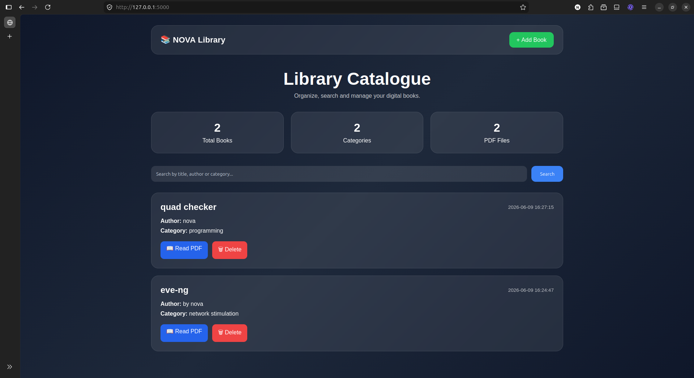
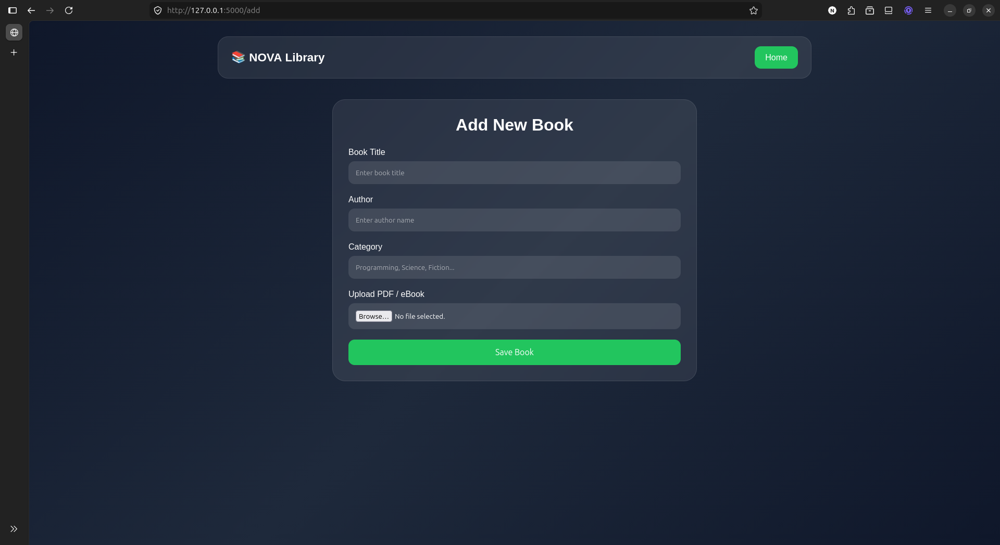
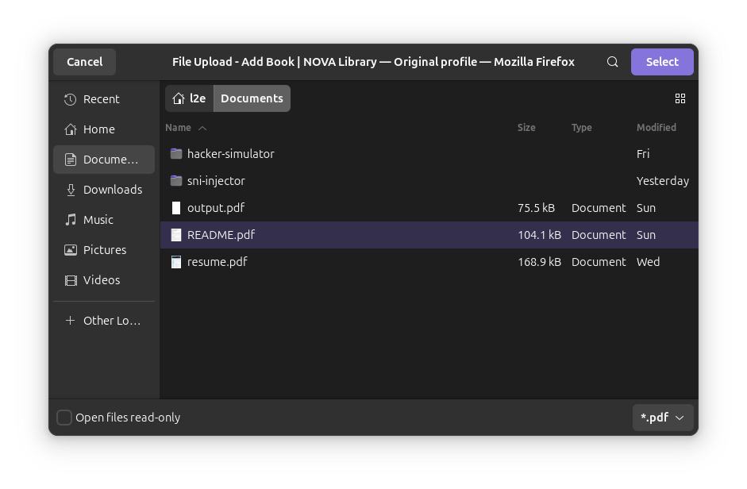
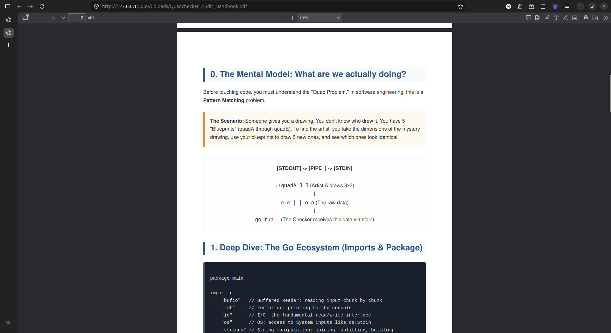

# 📚 NOVA Library Catalogue

A modern full-stack **Library Management System** built with Flask and SQLite.  
It provides a clean glassmorphism dashboard for managing books, uploading PDFs, and searching a digital library.

---

## 🌍 Live Demo

👉 https://nova-library-catalogue.onrender.com

---

## ✨ Features

- 📖 Add books (title, author, category)
- 🔍 Smart search system
- 🗑️ Delete books from catalogue
- 📂 Upload PDF / eBooks
- 📄 View and manage uploaded files
- 📊 Dashboard statistics (total books, categories, PDFs)
- 🎨 Modern glassmorphism UI design
- ⚡ Lightweight and fast Flask backend

---

## 🛠️ Tech Stack

- **Backend:** Python (Flask)
- **Database:** SQLite3
- **Frontend:** HTML5, CSS3
- **Deployment:** Render

---

## 📁 Project Structure

library_catalogue/
│
├── app.py
├── database.py
├── wsgi.py
├── requirements.txt
├── library.db
│
├── templates/
│ ├── index.html
│ └── add_book.html
│
├── static/
│ └── style.css
│
└── uploads/

---

## 🚀 Installation & Setup

### 1. Clone the repository

```bash id="2c9v0a"
git clone https://github.com/abdulmateen4real2009-source/nova-library-catalogue.git
cd nova-library-catalogue
2. Create virtual environment
python -m venv venv
source venv/bin/activate   # Linux / Mac
venv\Scripts\activate      # Windows
3. Install dependencies
pip install -r requirements.txt
4. Run the application
python database.py
python app.py
5. Open in browser
http://127.0.0.1:5000
🌐 Deployment

This project is deployed using Render.

Live URL:
👉 https://nova-library-catalogue.onrender.com
Start command:
gunicorn app:app
📌 Future Improvements
🔐 User authentication (admin login system)
☁️ Cloud database (PostgreSQL upgrade)
📱 Mobile responsive UI (PWA support)
📊 Advanced analytics dashboard
🖼️ Book cover image uploads
👨‍💻 Author

Abdul Mateen

GitHub: https://github.com/abdulmateen4real2009-source
Project: NOVA Library Catalogue
⭐ Support

If you like this project, please consider giving it a ⭐ on GitHub!

```

# SCREENSHOTS

<div>
  

 ###### HomePage
 .
</div>

<div>
 

 ###### Adding New Book
 .
</div>

<div>
 

  ###### File Selection
  .
</div>

<div>
 

  ###### PDF View
  .
</div>
